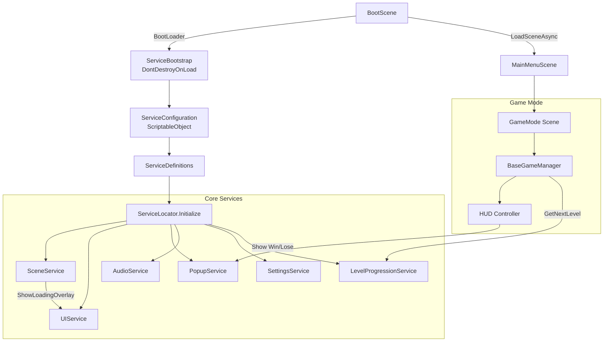
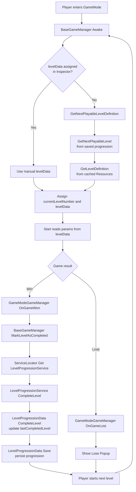

## Disclaimer

This project includes references and visual assets inspired by The Simpsons.

All rights to The Simpsons and related content belong to their respective owners.
This is a non-commercial project created for educational and portfolio purposes only.

## Simpsons Puzzle Game (Unity) — Technical Overview

A puzzle game project built in **Unity 6.0 (6000.3.12f1)** with multiple game modes and a reusable “core services” layer (UI, scenes, audio, popups, progression).

- **Engine**: Unity `6000.3.12f1` (see `ProjectSettings/ProjectVersion.txt`).

---

## Overview

The project is organized as a collection of independent **Game Modes** (e.g. `DonutStack`, `DrinkSort`, `BubbleMerge`) that share:

- **Boot + Bootstrap**: centralized, persistent initialization of services.
- **Decoupled services**: defined via `ScriptableObject` so features can be composed without hardcoding scene dependencies.
- **Level progression**: `LevelDefinition` loading per mode from `Resources/LevelDefinitions/...`.
- **UI/Popups**: a global loading overlay, per-mode HUDs, and cached popups.

---

## Architecture

### Diagram (Mermaid)



### Level & Progression Flow

This flow describes how a Game Mode initializes its data (either from the Inspector or the Progression Service) and how the win/loss state persists.



### Design principles

- **“Core vs. game mode” separation**: each mode encapsulates its own gameplay/UI and consumes shared core services.
- **Editor-time composition**: `ServiceConfiguration` enables toggling services without recompiling.
- **Partially data-driven**: levels and spawn weights are configured in `LevelDefinition` and `ItemData` assets.

---

## Folder structure (high level)

> Note: in a typical Unity repo you mainly version `Assets/`, `Packages/`, `ProjectSettings/` (and ignore `Library/`, `Logs/`, etc. as per `.gitignore`).

- **`Assets/`**: game content (code, scenes, prefabs, resources).
  - **`Assets/Scenes/Boot/BootScene.unity`**: boot scene.
  - **`Assets/Scenes/MainMenuScene.unity`**: main menu.
  - **`Assets/Scenes/GameModes/`**: per-mode scenes (`GameMode_DonutStack`, `GameMode_DrinkSort`, `GameMode_BubbleMerge`).
  - **`Assets/Scripts/Boot/`**: boot / global initialization.
  - **`Assets/Scripts/Core/`**: infrastructure (service locator, definitions, services).
  - **`Assets/Scripts/GameModes/`**: per-mode logic (core, gameplay, UI).
  - **`Assets/Resources/LevelDefinitions/`**: per-mode levels (loaded at runtime).
- **`Packages/manifest.json`**: Unity Package Manager dependencies.
- **`ProjectSettings/`**: project configuration (includes Unity version).
- **`Library/`, `Logs/`, `UserSettings/`**: generated folders (should not be versioned).

---

## Key systems (with snippets)

### 1) Boot & service initialization

Startup is split into two parts:

- `BootLoader` (in `BootScene`) instantiates the managers/services root prefab and then loads the Main Menu.
- `ServiceBootstrap` marks the root as `DontDestroyOnLoad` and initializes `ServiceLocator` with a `ServiceConfiguration`.

Boot flow snippet:

```15:49:Assets/Scripts/Boot/BootLoader.cs
        private IEnumerator Start()
        {
            if (bootOverlay != null)
                bootOverlay.SetActive(true);

            // Small delay so the UI actually appears on screen
            yield return new WaitForSeconds(0.2f);

            if (managersRoot != null)
            {
                ServiceBootstrap root = Instantiate(managersRoot, null);
                //DontDestroyOnLoad(root);
            }
            else
            {
                Debug.LogError("[BootLoader] ManagersRootPrefab is missing!");
            }

            // Load Main Menu (Single)
            AsyncOperation loadOp = SceneManager.LoadSceneAsync(GameConstants.MAIN_MENU_SCENE, LoadSceneMode.Single);
```

Persistent bootstrap snippet:

```31:46:Assets/Scripts/Boot/ServiceBootstrap.cs
        private void Awake()
        {
            if (serviceDefinitions == null)
            {
                Debug.LogError("[ServiceBootstrap] No ServiceConfiguration assigned!");
                return;
            }

            DontDestroyOnLoad(gameObject);
            ServiceLocator.Initialize(serviceDefinitions, this);
        }
```

### 2) Service Locator + ServiceDefinitions (ScriptableObject DI)

Services are composed from assets (`ServiceDefinition`) and registered by interface/concrete type in `ServiceLocator`.

```9:23:Assets/Scripts/Core/ServiceDefinition.cs
    public abstract class ServiceDefinition : ScriptableObject
    {
        public abstract IService CreateInstance(ServiceBootstrap bootstrap);
    }

    public abstract class ServiceDefinition<T> : ServiceDefinition where T : IService, new()
    {
        public override IService CreateInstance(ServiceBootstrap bootstrap)
        {
            return new T();
        }
    }
```

Runtime registration by interfaces:

```17:63:Assets/Scripts/Core/ServiceLocator.cs
        public static void Initialize(ServiceConfiguration config, ServiceBootstrap bootstrap)
        {
            if (isInitialized)
            {
                Debug.LogWarning("[ServiceLocator] Already initialized!");
                return;
            }

            Debug.Log($"[ServiceLocator] Initializing {config.Services.Count} services...");

            foreach (var serviceDefinition in config.Services)
            {
                // ...
                IService instance = serviceDefinition.CreateInstance(bootstrap);
                Type serviceType = instance.GetType();

                // Find all IService interfaces it implements
                foreach (var interfaceType in serviceType.GetInterfaces())
                {
                    if (interfaceType != typeof(IService) && typeof(IService).IsAssignableFrom(interfaceType))
                    {
                        services[interfaceType] = instance;
                        Debug.Log($"[ServiceLocator] Registered {interfaceType.Name}");
                    }
                }

                // Also register by concrete type
                services[serviceType] = instance;
                    
                instance.Initialize();
            }
```

### 3) Scene loading with a global overlay

`SceneService` centralizes loading and shows a global overlay (through `UIService`) for consistent feedback.

```31:66:Assets/Scripts/Core/Services/SceneService/SceneService.cs
        private IEnumerator LoadSceneRoutine(string sceneName, LoadSceneMode mode)
        {
            // Show global overlay
            UIService.ShowLoadingOverlay(true);

            // Optional: tiny delay to show overlay clearly
            yield return new WaitForSecondsRealtime(0.25f);

            AsyncOperation op = SceneManager.LoadSceneAsync(sceneName, mode);

            // Optionally show progress here
            while (!op.isDone)
                yield return null;

            // Hide global overlay
            UIService.ShowLoadingOverlay(false);
        }
```

### 4) Level progression (cache + Resources)

`LevelProgressionService` preloads per-mode definitions from `Resources/LevelDefinitions/...` and serves the “next playable level”.

```15:62:Assets/Scripts/Core/Services/LevelProgressionService/LevelProgressionService.cs
        private void LoadLevelDefinitionsCache()
        {
            var bubbleMergeLevels = Resources.LoadAll<BubbleMergeLevelDefinition>(BUBBLE_MERGE_LEVEL_DEFINITIONS_PATH)
                .Cast<LevelDefinition>()
                .OrderBy(ld => ld.levelNumber)
                .ToList();
            levelDefinitionsCache["BubbleMerge"] = bubbleMergeLevels;

            var drinkSortLevels = Resources.LoadAll<DrinkSortLevelDefinition>(DRINK_SORT_LEVEL_DEFINITIONS_PATH)
                .Cast<LevelDefinition>()
                .OrderBy(ld => ld.levelNumber)
                .ToList();
            levelDefinitionsCache["DrinkSort"] = drinkSortLevels;

            var donutStackLevels = Resources.LoadAll<DonutStackLevelDefinition>(DONUT_STACK_LEVEL_DEFINITIONS_PATH)
                .Cast<LevelDefinition>()
                .OrderBy(ld => ld.levelNumber)
                .ToList();
            levelDefinitionsCache["DonutStack"] = donutStackLevels;
        }
```

### 5) Gameplay example: DonutStack (hex grid + recursive matches)

`DonutStackGameManager` orchestrates the turn flow (stacks per turn), placement, and a recursive “match processing” loop that:

- moves pieces between neighboring stacks when their top color matches,
- destroys groups when they reach `PiecesToDestroy`,
- updates score and win/lose states.

Snippet (placement + match processing kickoff):

```175:205:Assets/Scripts/GameModes/DonutStack/Gameplay/DonutStackGameManager.cs
        public void TryPlaceStack(GridCell cell, Core.DonutStack stack)
        {
            if (stack == null || IsProcessingMatches) return;
            if (cell.IsOccupied) return;
        
            cell.SetStack(stack);
            stack.PlaceOnCell(cell);
            currentTurnStacks.Remove(stack);
        
            StartCoroutine(ProcessMatchesRecursive(cell));
        
            if (AllStacksPlaced())
            {
                Invoke(nameof(GenerateNewTurn), NewTurnDelay);
            }
        }
```

Hex grid (axial coords → UI position):

```23:92:Assets/Scripts/GameModes/DonutStack/Gameplay/DonutGrid.cs
        public void Initialize(int radius)
        {
            for (int q = -radius; q <= radius; q++)
            {
                int r1 = Mathf.Max(-radius, -q - radius);
                int r2 = Mathf.Min(radius, -q + radius);
            
                for (int r = r1; r <= r2; r++)
                {
                    CreateHexCell(q, r);
                }
            }
        }

        private Vector2 AxialToUI(Vector2Int axial)
        {
            float x = hexSize * (Mathf.Sqrt(3) * axial.x + Mathf.Sqrt(3) / 2f * axial.y);
            float y = hexSize * (3f / 2f * axial.y);
            return new Vector2(x, y);
        }
```

### 6) Gameplay example: DrinkSort (“matchable” spawning)

DrinkSort builds the initial spawn pool in **groups of 3** to guarantee matchability (trade-off: less pure randomness, better fairness).

```155:249:Assets/Scripts/GameModes/DrinkSort/Gameplay/DrinkSortGameManager.cs
        private List<SortableItemType> BuildInitialSpawnPoolByWeights(int totalItemsToSpawn)
        {
            // We spawn in groups of 3 identical items to guarantee matchability.
            if (totalItemsToSpawn <= 0)
            {
                return new List<SortableItemType>();
            }

            int totalGroups = totalItemsToSpawn / 3;
            if (totalGroups <= 0)
            {
                return new List<SortableItemType>();
            }

            // Use the configured weights as a proportional target distribution (e.g. Red=30 means ~30% of groups).
            // ...
            List<SortableItemType> pool = new List<SortableItemType>(totalGroups * 3);
            for (int i = 0; i < types.Count; i++)
            {
                for (int g = 0; g < baseGroups[i]; g++)
                {
                    pool.Add(types[i].Type);
                    pool.Add(types[i].Type);
                    pool.Add(types[i].Type);
                }
            }
            return pool;
        }
```

---

## Technical decisions

- **Service composition via ScriptableObjects** (`ServiceConfiguration` + `ServiceDefinition`):
  - Lets you wire services in the editor and keep infrastructure separate from gameplay.
  - Makes manual testing easier (swap services without touching scenes), at the cost of configuration discipline.

- **Dedicated boot scene**:
  - Guarantees a single initialization entry point and reduces reliance on scene execution order.

- **Level data in `Resources` (cached)**:
  - Simplifies loading and rapid iteration.
  - Important trade-off: `Resources` scales worse than Addressables for large projects.

- **Isolated game modes with `BaseGameManager<T>`**:
  - Lifecycle conventions (pause, win/lose, current level, HUD).
  - Reuses progression and popups without duplicating logic.

---

## Trade-offs (concrete)

- **Service Locator vs explicit DI**
  - **Pros**: lower friction in Unity (especially with `MonoBehaviour` + scenes), simple global access.
  - **Cons**: can hide dependencies and make “pure” unit testing harder as the codebase grows.

- **`Resources.LoadAll` for levels**
  - **Pros**: fast to implement, reliable for a prototype/portfolio project.
  - **Cons**: loads the entire mode’s set; for scaling/streaming you’d typically move to Addressables (already present in `Packages/manifest.json`).

- **Gameplay logic in managers**
  - **Pros**: linear, reviewer-friendly control flow.
  - **Cons**: if scope grows, you may need to extract systems/state machines to preserve SRP.

---

## How to run (partial but practical)

### Requirements

- **Unity Editor**: `6000.3.12f1`
- (Optional) IDE: Rider or Visual Studio (packages `com.unity.ide.rider` / `com.unity.ide.visualstudio` are included).

### Run in the Editor

1) Open the project from Unity Hub.
2) Open `Assets/Scenes/Boot/BootScene.unity`.
3) Press Play.
   - `BootLoader` instantiates the service root and loads `MainMenuScene` by name (`GameConstants.MAIN_MENU_SCENE`).
4) From the Main Menu, pick a mode:
   - `DonutStack`, `DrinkSort`, `BubbleMerge` (each has a scene under `Assets/Scenes/GameModes/`).

### Run a mode directly (debug workflow)

- Open `Assets/Scenes/GameModes/GameMode_DonutStack.unity` (or any mode) and press Play.
- Note: if the mode relies on global services (UI/Popups/Progression), entering via `BootScene` ensures consistent initialization.

---

## Packages (relevant selection)

From `Packages/manifest.json`:

- **`com.unity.addressables`**: content loading/streaming support (useful when scaling content pipelines).
- **`com.unity.ugui`** + **TextMeshPro** (via project packages): UI.
- **`com.unity.feature.2d`**: 2D stack.

